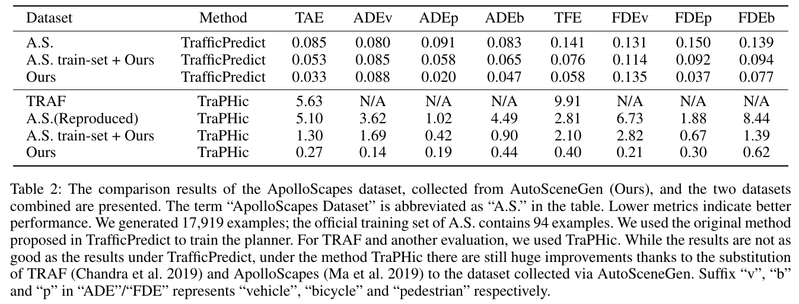
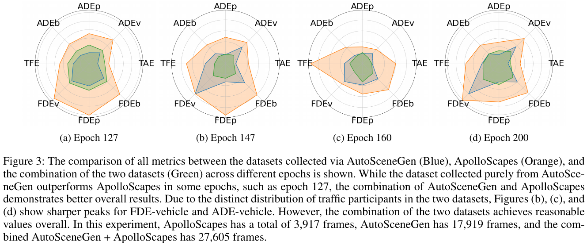

# Generating Traffic Scenarios via In-Context Learning to Learn Better Motion Planner


<h5 align="center">

[](https://arxiv.org/abs/2412.COMING_SOON)
[](https://ezharjan.github.io/AutoSceneGen)
[](https://github.com/Ezharjan/blob/AutoSceneGen/master/LICENSE)
[](https://github.com/Ezharjan/AutoSceneGen)🔥🔥🔥
 <br>

</h5>

Welcome to the official code repository for "[Generating Traffic Scenarios via In-Context Learning to Learn Better Motion Planner **(AAAI 2025)**](https://arxiv.org/abs/2412.COMING_SOON)".

🔍 For more details, please refer to the project page: [https://ezharjan.github.io/AutoSceneGen/](https://ezharjan.github.io/AutoSceneGen/).


## 📰 News

<!-- * [2024/12/29] 🚀 Paper is available on arXiv! -->
* [2024/12/17] 🔥 All source code and necessary dataset examples used in the AutoSceneGen framework experiments have been officially released.
* [2024/12/09] 🌟 Paper proposing AutoSceneGen framework accepted by AAAI 2025 Main Track! 🎉 Cheers!
* [2024/08/19] 🔥 Source code and the example datasets of AutoSceneGen framework are partially released!


## 👀 Introduction


Motion planning is a crucial component in autonomous driving. State-of-the-art motion planners are trained on meticulously curated datasets, which are not only expensive to annotate but also insufficient in capturing rarely seen critical scenarios. Failing to account for such scenarios poses a significant risk to motion planners and may lead to incidents during testing.

## 💡 Motivations

- High cost and limitations of current datasets.
- Risk of incidents due to unaccounted critical scenarios.
- High human costs of manually composing scenarios.


## 🗝️ Proposed Solution

- An inexpensive method for generating diverse critical traffic scenarios.
- Representing traffic scenarios as scripts for simulators.
- Using Large Language Models (LLMs) to translate user-specified text descriptions into scripts.
- Generating abundant safety-critical traffic scenarios for synthetic training data.
- Collecting the data from the physics-based simulator and augment/replace the real-world datasets.


## 💪 Strengths

- Cost-effective and efficient data generation than collecting real-world datasets.
- Improved robustness of motion planners.
- Significant performance improvement in motion planners trained with synthetic data.
- Automatically generates datasets with real-world features.
- Provides easy control over dataset heterogeneity, especially for safety-critical scenarios.

Efficiently evaluating autonomous vehicles (AVs) under diverse real-world challenges on a limited budget is crucial for ensuring their safety and sustaining long-term development in the AV industry. While existing works rely on real-world datasets, generated custom virtual dataset, generated using “AutoSceneGen” framework, produces improved prediction results. 


## ⚙️ Usage

### 1. Choosing a Large Language Model (LLM)

- After a thorough comparison of in-context learning (ICL) capabilities across various models, GPT-4 was selected for this experiment.  
- To use GPT-4, insert your OpenAI API token into the appropriate section of [this script](./Codes/ICL/passwords.py).  
- For further customization or requirements, please refer to the [OpenAI API Documentation](https://platform.openai.com/docs/api-reference/introduction).  
- While GPT-4 is the primary choice, you may also explore alternative language models.  
- If you wish to evaluate the ICL capabilities of different models, I recommend using [Ollama](https://ollama.com/) for a quick and convenient overview.  

### 2. Choosing a Simulator

- After conducting exploratory experiments across various simulators, including:  
  - [AirSim](https://github.com/microsoft/AirSim)  
  - [CARLA](https://carla.org/)  
  - [LGSVL](https://hidetoshi-furukawa.github.io/post/lgsvl-simulator/) *(now deprecated, but an [alternative replica](https://github.com/YuqiHuai/SORA-SVL) was utilized)*  
  - [Udacity](https://github.com/udacity/self-driving-car)  

  **CARLA version 0.9.13** was ultimately chosen due to its active open-source community, extensive public documentation, and consistent updates.  

- Note that many open-source simulators for autonomous vehicle (AV) evaluation have become inactive or entered slow development cycles. For complex simulation scenarios, further customization of the simulator may be required to meet specific project needs.  
- Ensure you have access to the simulator's documentation to construct relevant few-shot learning exemplars tailored to the simulator's capabilities.  

### 3. Constructing Exemplars

- **Zero-shot exemplar construction**:  
   - For simple scenario generation (e.g., varying weather or road conditions), exemplar construction is unnecessary when using GPT-4 and CARLA 0.9.13.  
   - GPT-4 already incorporates CARLA's documentation within its training set. The primary requirement is to ensure that the user's description is clearly and effectively structured.  

- **One-shot/Few-shot exemplar construction**:  
   - For complex scenario generation, pre-constructed example codes and templates are necessary to guide the LLM.  

### 4. Data Collection

- Once the scenarios are generated, data can be collected directly from the simulator.  
- This repository provides scripts for trajectory data collection using CARLA 0.9.13.  
- For collecting other types of data, refer to the simulator's respective data collection API documentation.  
- Data collection speed can be configured based on your hardware capabilities and project requirements.  

### 5. Dataset Augmentation & Replacement

- Replace the collected dataset as needed and train motion planners using state-of-the-art (SOTA) trajectory prediction methods from scratch.  
- Combine real-world datasets with simulated data for more robust training.  
- Compare trajectory prediction results to evaluate performance improvements.  
- Depending on the type of collected data, you may explore additional tasks, such as:  
  - **Image data**: Object detection, semantic segmentation, depth estimation, and scene reconstruction.  
  - **LiDAR data**: Point cloud classification, object localization, and 3D object detection.  
  - **Trajectory data**: Behavior prediction, path planning, and motion control.  


## ✉️ Contact  

For inquiries or further information, please reach out via email at [mc25101_AT_umac.mo](mailto:mc25101_AT_umac.mo).


<!-- ## 📜 Result





-->


## 🌹 Acknowledgements  

I would like to express my deepest gratitude to the open-source communities behind various simulators, as well as the independent researchers, engineers, and contributors who have generously shared foundational codes and toolkits. Their unwavering commitment to advancing technology and knowledge, often beyond commercial interests, has been instrumental to this work.  

- [CARLA](https://carla.org/)  
- [AirSim](https://github.com/microsoft/AirSim)  
- [SORA-SVL](https://github.com/YuqiHuai/SORA-SVL)  
- [TrafficPredict](https://github.com/sibozhang/TrafficPredict)  
- [Pishgu](https://github.com/TeCSAR-UNCC/Pishgu)  
- [Vehicle-Trajectory-Prediction-on-NGSIM](https://github.com/dotah88/Vehicle-Trajectory-Prediction-on-NGSIM)


## 📝 Citation

Please cite this work if the code is utilized or if the findings are referenced in your research:

```
@article{aizierjiang2024autoscene,
  title={Generating Traffic Scenarios via In-Context Learning to Learn Better Motion Planner},
  author={Aizierjiang Aiersilan},
  journal={arXiv preprint arXiv:2412.COMING_SOON},
  year={2024}
}
```

